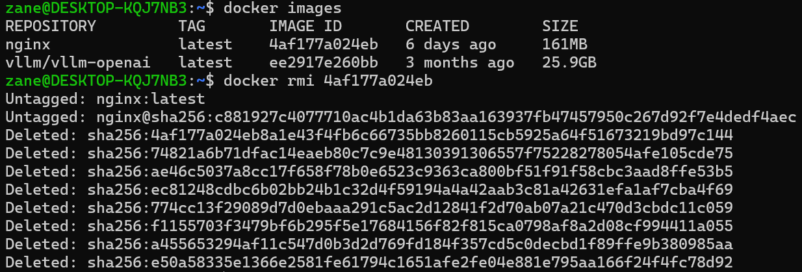
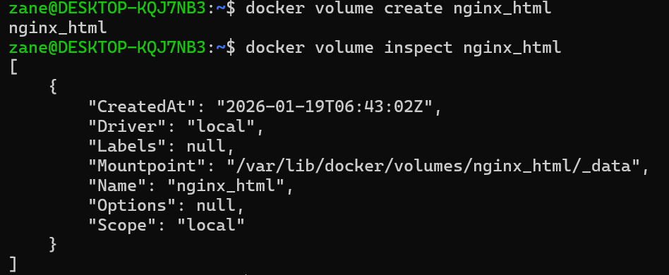
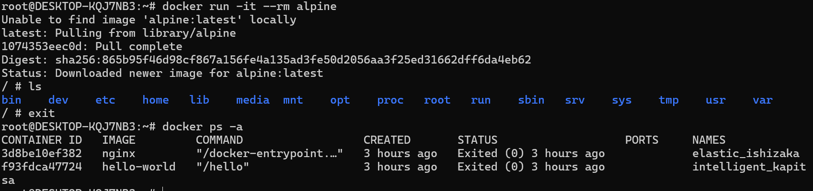
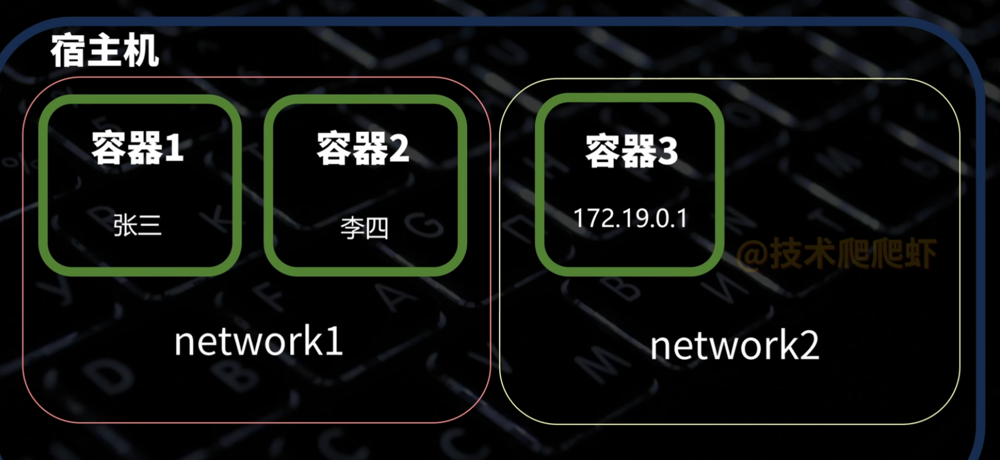
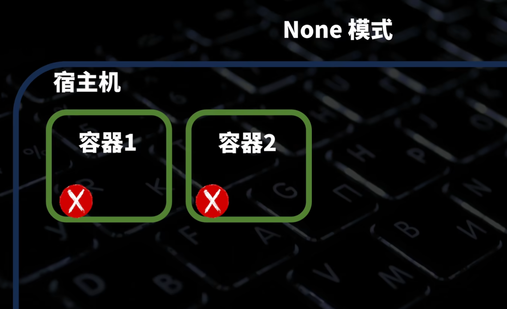
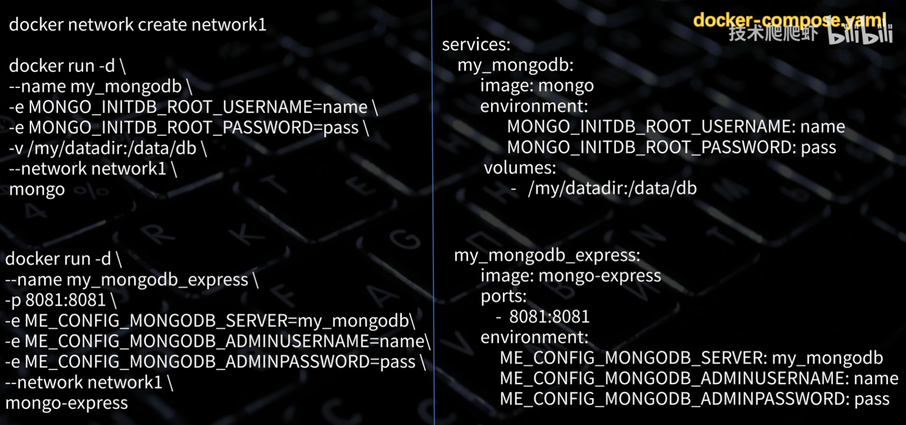

# docker

## 1.pull

```docker
docker pull xxxx
```

## 2.images

```docker
docker images
```

## 3.change the root password

```powershell
wsl -l -v
```

你可能会看到类似这样的列表：

- `docker-desktop` (Running)
- `docker-desktop-data` (Running)
- `Ubuntu` (Running)  <-- **我们要找的是这个！也可能叫 Ubuntu-20.04 之类的。**

假设你的那个名字叫 `Ubuntu`（如果是别的，替换掉下面命令里的 Ubuntu）。输入：

```powershell
wsl -d Ubuntu -u root
```

- **解释**：`-d` 指定房间，`-u root` 指定身份。这行命令的意思是：“我是 Windows 管理员，我现在要以 Linux 上帝（root）的身份直接空降到 Ubuntu 房间里。”
- **现象**：你的提示符会立刻变成白色或黑色的 `root@...`，**不需要输入任何密码**。

现在你已经是上帝了，直接发号施令。输入：

```bash
passwd zane
```

1. 输入新密码（屏幕不会显示星号，盲输）。
2. 回车。
3. 再输一遍确认。
4. 看到 `password updated successfully`。

顺手把“免 sudo”也做了（给 Agent LeetCode 铺路）。

既然你现在还是上帝（root）状态，直接把 `zane` 拉进 Docker 管理组，省得以后每次都要输密码：

```bash
usermod -aG docker zane
```

输入 exit 退出 Linux，回到 PowerShell。

然后输入下面这就话，让刚才的设置彻底生效：

```powershell
wsl --shutdown
```

(这一步会让所有 Linux 关机。等几秒钟，再重新打开你的 Ubuntu 终端。)

## 4.删除镜像rmi

```docker
docker rmi 4af177a024eb
```



## 5.run

```docker
docker run xxxx
docker run -d xxxx
```

```docker
docker run -p 80:80 xxxxx
```


挂载卷(绑定挂载)：

```docker
docker run -v 宿主机目录:容器内目录
```


创建一个存储空间（命名卷）

```docker
docker volume create xxxx
```

```docker
 docker volume inspect xxxx
```



切换为root用户：

```docker
sudo -i 
```

命名卷挂载：

```docker
docker run -v 卷的名字:容器内目录
```

## 6.ps

```docker
docker ps
docker ps -a
```

## 7.删除容器rm -f

```docker
docker rm -f xxxx
```

## 8.volume list/volume rm/volume prune -a

```docker
docker volume list
docker volume rm nginx_html
docker volume prune -a //删除所有没有任何容器在使用的卷
```

## 9.run -e

```docker
docker run -d \
-p 27017:27017 \
-e MONGO_INITDB_ROOT_USERNAME = tech \
-e MONGO_INITDB_ROOT_PASSWORD = shrimp \
mongo
```

## 10.run -it --rm

* `-it`:进入容器控制台命令
* `--rm`:容器终止运行的时候顺便删除掉

```docker
docker run -it --rm alpine
```



## 11.run --restart

```docker
docker run -d --restart always nginx //始终重启
docker run -d --restart unless-stopped nginx //意外终止的容器会重启，手动终止的容器不会重启
```

## 12.start/stop

```docker
docker start xxxx
docker stop xxxx
```

## 13.inspect

```docker
docker inspect xxxx
```

```json
[
    {
        "Id": "sha256:4af177a024eb8a1e43f4fb6c66735bb8260115cb5925a64f51673219bd97c144",
        "RepoTags": [
            "nginx:latest"
        ],
        "RepoDigests": [
            "nginx@sha256:c881927c4077710ac4b1da63b83aa163937fb47457950c267d92f7e4dedf4aec"
        ],
        "Parent": "",
        "Comment": "buildkit.dockerfile.v0",
        "Created": "2026-01-13T01:22:57.074358457Z",
        "DockerVersion": "",
        "Author": "",
        "Architecture": "amd64",
        "Os": "linux",
        "Size": 160646317,
        "GraphDriver": {
            "Data": {
                "LowerDir": "/var/lib/docker/overlay2/ef417731c256684b2c0bb558d3d2c93f9e3f0450fd27b449719f4cae7b012649/diff:/var/lib/docker/overlay2/4111c6742429767856deada3d05038c8dd06d840d68b638b745cb9767039d12c/diff:/var/lib/docker/overlay2/1dd655551d9dc625b1751486ec881549de53f1958a82a497cf42354b065a63a4/diff:/var/lib/docker/overlay2/d4e620dfbd5255bd8787f07572d5da9e55e5cb10968e353018e4b70e6c48b8d5/diff:/var/lib/docker/overlay2/56b03514b35c49a79024fedb51f41a3973fd0be439bab8cfe9a8b55d4c677d98/diff:/var/lib/docker/overlay2/abd27d3b0ca785a0ffdba78ff62fb5a0248b4c5af027c0be5ff42bffcf922d90/diff",
                "MergedDir": "/var/lib/docker/overlay2/803f0e67c846971e65129768e3d7c71e476d71a6928e255f91d7533480bc562c/merged",
                "UpperDir": "/var/lib/docker/overlay2/803f0e67c846971e65129768e3d7c71e476d71a6928e255f91d7533480bc562c/diff",
                "WorkDir": "/var/lib/docker/overlay2/803f0e67c846971e65129768e3d7c71e476d71a6928e255f91d7533480bc562c/work"
            },
            "Name": "overlay2"
        },
        "RootFS": {
            "Type": "layers",
            "Layers": [
                "sha256:e50a58335e1366e2581fe61794c1651afe2fe04e881e795aa166f24f4fc78d92",
                "sha256:e84c0e25063eeb842f4f4e0f24832bf5e284a6295087cf39d89226d452b1f8a8",
                "sha256:547c913b410853c492aa1716915b9587694e1b9b01acc600113d4f45ea92a027",
                "sha256:4c34f6878173893d02b25ac03dc46d260cba289458eea41f8897c588acc314a9",
                "sha256:3b4fce0e490d8156cc0c9543d6567e7889d44adafdecf8e6e0439f1dd988f542",
                "sha256:4b53e01dba290e9155b9e06648048b2b19cdc2368d3fb3b4eb84a7f2296988ac",
                "sha256:d9d3f8c27ad75d28daa394f08d026da593d05249469a97bbc337a73f08d92f0b"
            ]
        },
        "Metadata": {
            "LastTagTime": "0001-01-01T00:00:00Z"
        },
        "Config": {
            "Cmd": [
                "nginx",
                "-g",
                "daemon off;"
            ],
            "Entrypoint": [
                "/docker-entrypoint.sh"
            ],
            "Env": [
                "PATH=/usr/local/sbin:/usr/local/bin:/usr/sbin:/usr/bin:/sbin:/bin",
                "NGINX_VERSION=1.29.4",
                "NJS_VERSION=0.9.4",
                "NJS_RELEASE=1~trixie",
                "ACME_VERSION=0.3.1",
                "PKG_RELEASE=1~trixie",
                "DYNPKG_RELEASE=1~trixie"
            ],
            "ExposedPorts": {
                "80/tcp": {}
            },
            "Labels": {
                "maintainer": "NGINX Docker Maintainers \u003cdocker-maint@nginx.com\u003e"
            },
            "OnBuild": null,
            "StopSignal": "SIGQUIT",
            "User": "",
            "Volumes": null,
            "WorkingDir": ""
        }
    }
]
```

## 14.logs

```docker
docker logs xxxx
docker logs xxxx -f
```

## 15.exec 

```docker
docker exec xxxxxx [linux-command]
```

 ```docker
 docker exec xxxxxx ps -ef //查看容器内部的进程情况
 ```

```docker
docker exec -it xxxx /bin/sh
```

## 16.Dockerfile

```dockefile
FROM python:3.13-slim

WORKDIR /app

COPY . .

RUN pip install -r requirements.txt

EXPOSE 8000

CMD ["python3","main.py"]

ENTRYPOINT["python3","main.py"]
```

```docker
docker build -t zhysfl/test .
docker push zhysfl/test
```

## 17.network



```docker
docker network create network1

docker run -d \
--name my_mongodb \
-e MONGO_INITDB_ROOT_USERNAME = tech \
-e MONGO_INITDB_ROOT_PASSWORD = shrimp \
--network network1
mongo

docker run -d \
--name my_mongodb_express \
-p 8081:8081 \
-e ME_CONFIG_MONGODB_SERVER=my_mongodb \
-e ME_CONFIG_MONGODB_ADMINUSERNAME-tech \
-e ME_CONFIG_MONGODB_ADMINPASSWORD=shrimp \
--network network1 \
mongo-express
```


## 18.host

```docker
docker run -d --network host nginx
```

## 19.None 模式



```docker
docker network list
```

三种默认网络形式：

```docker
NETWORK ID     NAME      DRIVER    SCOPE
d035b48ff421   bridge    bridge    local
ae32f3f11867   host      host      local
0e5bec45bd97   none      null      local
```

我们自定义的网络：

```docker
NETWORK ID     NAME      DRIVER    SCOPE
b286e0358baf   network1  bridge    local
```

删除自定义网路：

```docker
docker network rm b286e0358baf
```

## 20.docker compose

`docker-compose.yaml`:

docker会为每一个compose文件都自动创建一个子网，不用我们操心。同一个compose里所有容器都会自动加入这个子网。



定义启动顺序：


启动（如果已经启动则不做任何动作）：

```docker
docker compose up -d
```

停止并删除容器：

```docker
docker compose down
```

停止但不删除容器：

```docker
docker compose stop
```

再次启动：
```docker
docker compose start
```

| **场景**                   | **start**           | **up**               | **评价**      |
| -------------------------- | ------------------- | -------------------- | ------------- |
| **容器不存在**             | ❌ 报错              | ✅ **创建并启动**     | `up` 胜       |
| **容器存在，配置没改**     | ✅ 启动它            | ✅ 启动它 (复用)      | 平局          |
| **容器存在，但你改了配置** | ⚠️ **启动旧的 (坑)** | ✅ **重建并启动新的** | **`up` 完胜** |

docker compose识别非标准配置文件：

```docker
docker compose -f test.yaml up -d 
```

## 21.限制只能用 0.5 个 CPU核，内存最多 512MB

```docker
docker run -d --cpus="0.5" --memory="512m" nginx
```
